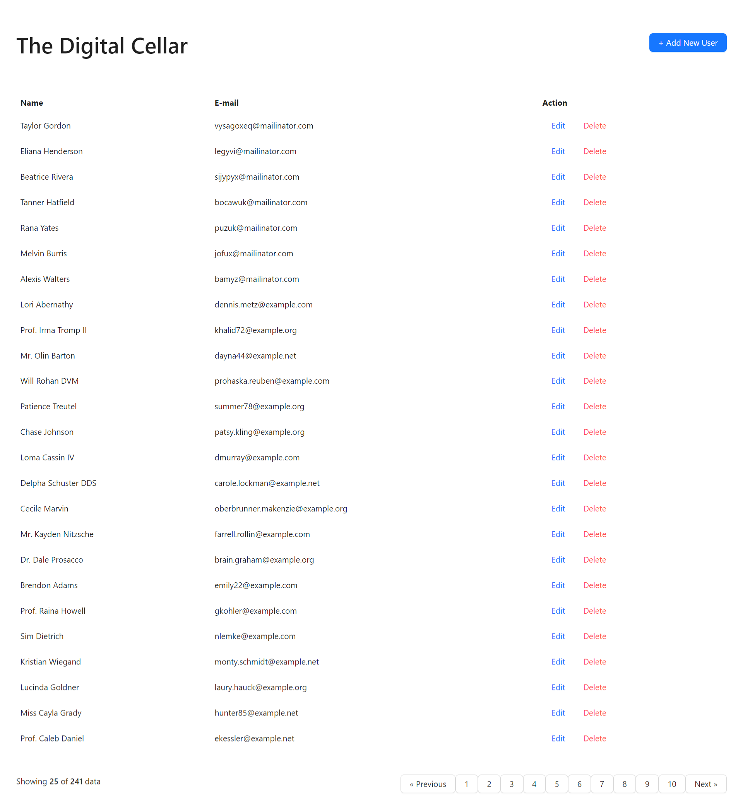
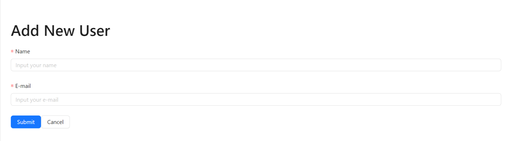
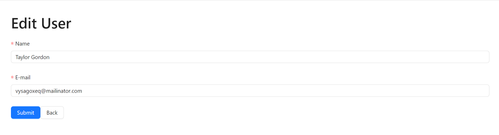
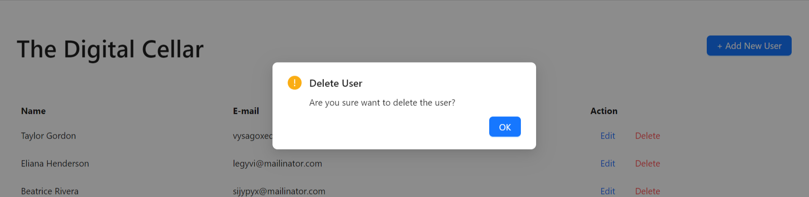

# React CRUD User with RESTful API

React application with management user features.

## Features
1. See a list of all users with pagination.
2. Create a new user.
3. Edit the user data.
4. Delete user.

## How to setup this application
1. Run `git clone https://github.com/imamsutono/react-crud-user.git` command.
2. Go to the project directory with `react-crud-user`.
3. Run `npm install` or `yarn install` to install the dependencies.
4. Run `vite dev` to run the application.
5. Open the application in `http://localhost:5173/`

## Application Screenshot

### User list

### Create a new user

### Edit user

### Delete user

## Supporting documents
1. [Product Requirement Document](https://docs.google.com/document/d/12_tLr3rInN8tx4vcSzLZxesBiwg5smWESbF_Xntp8Mg/edit?usp=sharing)
2. [Technical Requirement Document](https://docs.google.com/document/d/1l8x8xrsbfXlCe2I1bii3SkBVG5xnK7pBP0e6FDZ9pQY/edit?usp=sharing)